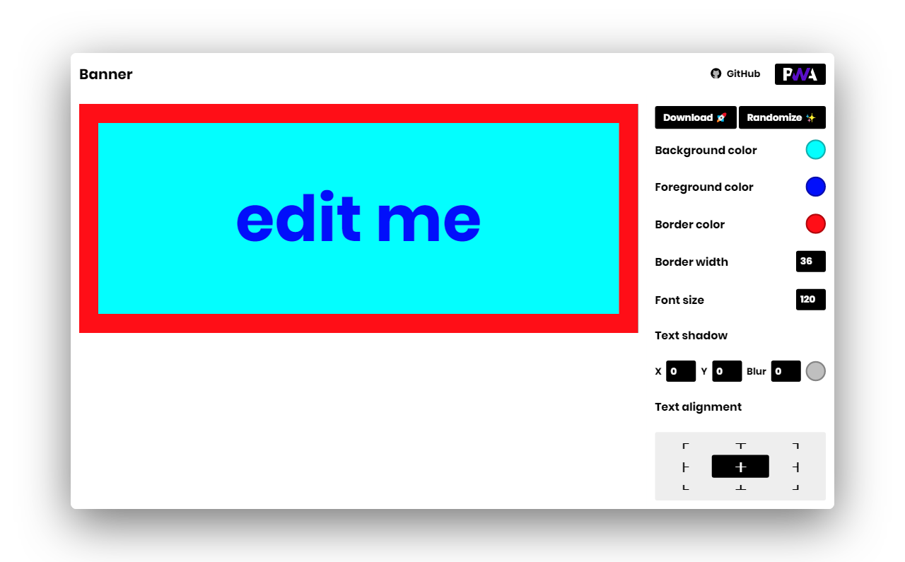
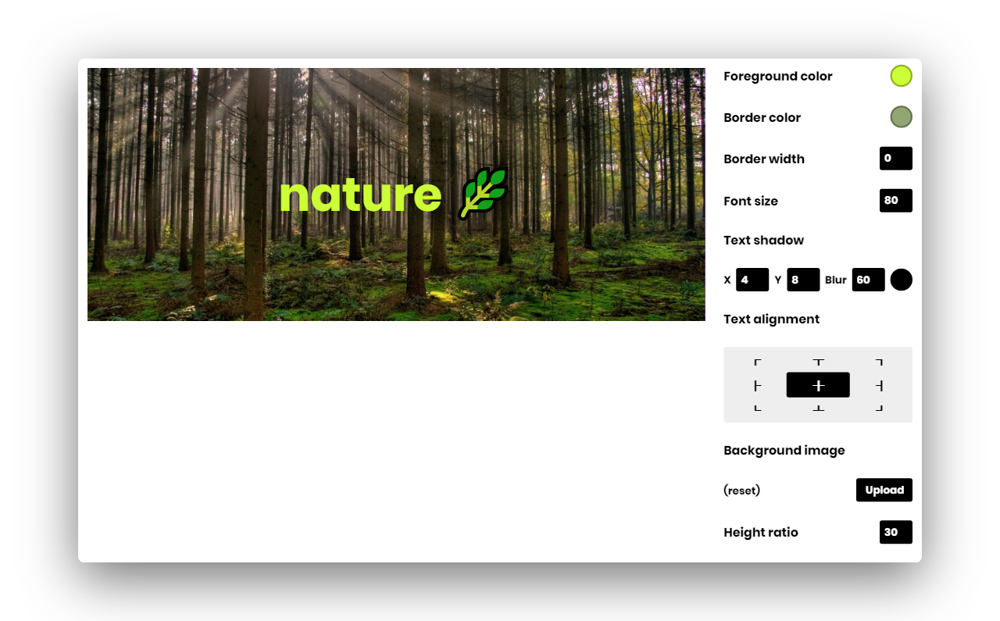

#  Banner

### 🚩 A simple and clean banner generator

   
  
  
   

### Features :sparkles:

:heart: **Lightweight and minimal**: Crafted with minimalistic UI design

:electric_plug: **Real-time demo**: WYSIWYG (what you see is what you get) banner editor 

:zap: **Make it your own**: Customize everything!

:robot: **AI**: Generate combination colors for background and foreground

:sparkles: **Choose custom colors**: Randomize or choose your own colors

:rocket: **Save**: Download generated banner to disk

---

## Demo

1. Give a heading
2. Customize everything!
3. Download banner

You're done!

---

## Contributing

Please read [CONTRIBUTING](CONTRIBUTING.md) for details on our [CODE OF CONDUCT](CODE_OF_CONDUCT.md), and the process for submitting pull requests to us.

---

## License

This project is licensed under the [MIT License](https://opensource.org/licenses/MIT) - see the [LICENSE](LICENSE) file for details.

---

## Acknowledgments

* Hat tip to anyone who's code was used
* Inspirations:
	* [Dribbble](https://dribbble.com)
